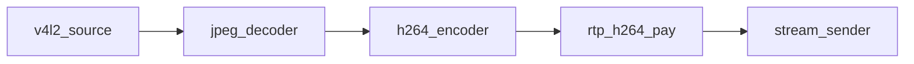
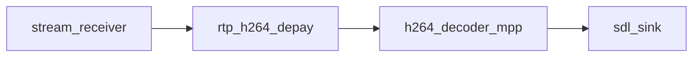

# Reference pipeline

Pad notation: `node.pad` — `A -> B.0` means A’s output links to B’s input pad 0.

## Rover (transmit)

| Link | Kind |
|------|------|
| … → `stream_sender.0` | `SOCK` (RTP datagrams) |

Reverse-path RX/gap metrics are not on the media graph.

### Telemetry

Receiver link counters (`udp_packet_received`, gaps, FEC stats) reach the
`stream_sender.peer_*` / `peer_loss_*` **metrics only in-process**: `stream_sdl` reads
`stream_receiver::link_counters_snapshot()` and publishes them under the sender's metric names
(`metrics_sync.cpp`). They are not `stream_sender` keys. A cross-host telemetry datagram on the
reverse UDP path is not implemented yet (planned with the sender/receiver app split). Encoder
rate is set via `configure("cbr")` or the bench console (`set_encode_cbr`).

Factory names: `v4l2_source`, `jpeg_decoder_multicore`, `h264_encoder_cedar`,
`rtp_h264_pay`, `stream_sender`.

## Ground station (receive)

| Link | Kind |
|------|------|
| `stream_receiver.0` → `rtp_h264_depay` | `SOCK` |
| decoder → `sdl_sink` | `FRAME` / NV12 |

Factory names: `stream_receiver`, `rtp_h264_depay`, `h264_decoder_mpp`, `sdl_sink`
(`display`; configure `video_driver=kmsdrm` or factory aliases `sdl_kmsdrm` for DRM/KMS).
Build with `-DENABLE_SDL_SINK=ON` (requires SDL2).

## Legacy aliases

`stream_sink` / `stream_source` factory names map to `stream_sender` /
`stream_receiver`.
