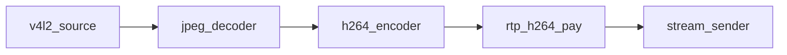
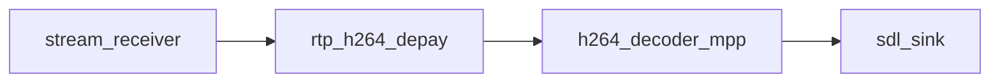

# Reference pipeline

Pad notation: `node.pad` — `A -> B.0` means A’s output links to B’s input pad 0.

**App binaries:** `uvc_stream_sender` and `sdl_stream_receiver` implement the rover TX and GS RX
graphs below. `stream_sdl` runs both graphs in one process plus the UDP channel emulator; all three
link the same `vstreamer_bench_pipeline` stage/metrics code in `src/apps/stream_sdl_test/`.

## Rover (transmit)

| Link | Kind |
|------|------|
| … → `stream_sender.0` | `SOCK` (RTP datagrams) |

Reverse-path RX/gap metrics are not on the media graph.

### Telemetry

Receiver link counters flow **receiver → reverse UDP → sender**: periodic 48-byte reports
(`stream_telemetry.hpp`) to the media source address; `stream_sender::peer_link_snapshot()` and
`peer_*` query keys hold the last report. The app derives `peer_loss_*` from counter deltas.
`scripts/cbr_controller.py` holds AIMD increases when `peer_report_age_ms` is stale (> 3×
`telemetry_ms`, or no report yet). In the `stream_sdl` bench the reports cross `link_emulator`'s
reverse direction, the NAT-style return path of the forward flow, so reverse-path loss is
emulated too. Encoder rate: `configure("cbr")` or bench `set_encode_cbr`.

Factory names: `v4l2_source`, `jpeg_decoder_multicore`, `h264_encoder_cedar`,
`rtp_h264_pay`, `stream_sender`.

## Ground station (receive)

| Link | Kind |
|------|------|
| `stream_receiver.0` → `rtp_h264_depay` | `SOCK` |
| decoder → `sdl_sink` | `FRAME` / NV12 |

Factory names: `stream_receiver`, `rtp_h264_depay`, `h264_decoder_mpp`, `sdl_sink`
(`display`; configure `video_driver=kmsdrm` or factory aliases `sdl_kmsdrm` for DRM/KMS).
Build with `-DENABLE_SDL_SINK=ON` (requires SDL2).

### Latency (capture → present)

Inside each host, stages measure delay with the local monotonic clock
(`capture_mono_ns` on frames, deltas via `steady_mono_ns()`). On the wire, `rtp_h264_pay` converts
capture time to **CLOCK_REALTIME** in the RTP extension; `rtp_h264_depay` converts back to local
monotonic on output. Glass latency (`stream_sdl.glass_latency_ms`, `latency.glass_ms`) is
capture → display and is meaningful across hosts when clocks are synchronized.

Stage names map to cumulative `latency.<stage>_ms` and per-node `latency.<stage>_node_ms`
(`source` → `latency.source_ms` / `source_node_ms`, …). Bench apps also publish
`<component>.latency_ms` (cumulative) and `<component>.node_latency_ms` (per-node). Split apps:
TX on `uvc_stream_sender` (`:5090`), RX on `sdl_stream_receiver` (`:5091`). See
[vstreamer.md § Latency metrics](vstreamer.md#latency-metrics).

## Legacy aliases

`stream_sink` / `stream_source` factory names map to `stream_sender` /
`stream_receiver`.
