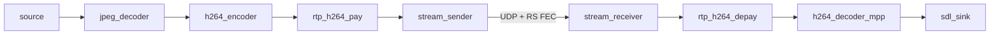

# VStreamer

VStreamer is a C++17 library of independent video **components** (sources, coders, sinks) and
the bench apps that wire them into a low-latency H.264-over-UDP path with Reed–Solomon FEC.
The target is a rover camera (UVC → H.264 → radio) and a ground-station viewer (radio → decode
→ display). Today the loopback bench binary `stream_sdl_test` runs both ends in one process over loopback.

This page describes the code as it is. Designed-but-not-built pieces (feedback plugin, config
loader, core console, rover/winject wiring) are listed under
[Roadmap / target design](#roadmap--target-design).



## Component model

All interfaces live in `src/core/`.

| Interface | Header | Data path |
|-----------|--------|-----------|
| `component` | [component.hpp](../src/core/component.hpp) | `configure(key, value)` / `query(key, &value)` |
| `component_source` | [component_source.hpp](../src/core/component_source.hpp) | `output(port, data_packet&, timeout_ms)` |
| `component_coder` | [component_coder.hpp](../src/core/component_coder.hpp) | `input(port, const data_packet&)` + `output(…)` |
| `component_sink` | [component_sink.hpp](../src/core/component_sink.hpp) | `input(port, const data_packet&)` + `set_enabled(on, timeout_ms)` |

Every component has `name()`, `open()` / `close()`, and declares what it carries:
`input_kind()` / `output_kind()` (`media_kind_e`: `MJPEG`, `NV12`, `H264`, …) and
`input_packet_kind()` / `output_packet_kind()` (`packet_kind_e`: `FRAME`, `AUDIO`, `SOCK`).
Pads are numbered ports; all current components use port 0.

**Return codes.** `0` on success, negative errno otherwise. `output()` returns `-EAGAIN` when
nothing is ready within `timeout_ms` (`< 0` blocks, `0` polls, `> 0` waits).

### `configure` / `query` contract

```cpp
/* 0 on success, -ENOTSUP unknown key, -EINVAL bad value, other -errno. */
virtual int configure(std::string_view key, std::string_view value) = 0;
/* Fills *value (overwritten). 0 / -ENOTSUP / -EINVAL. Thread-safe. */
virtual int query(std::string_view key, std::string *value) const = 0;
```

- Keys and values are strings. Integers are decimal (`key_parse_i64`: no `+`, no octal/hex),
  except V4L2 control ids, which also accept `0x…`.
- Unknown key → `-ENOTSUP`, bad value → `-EINVAL`, key only valid before `open()` → `-EBUSY`.
  `tests/component_contract_test.cpp` checks the unknown-key rule on every built component.
- `configure` may be called from another thread (e.g. a console) while the pipeline runs;
  each component locks internally. Keys marked *live* below take effect without reopening.

### `data_packet` and buffers

Wires carry `data_packet` ([data_packet.hpp](../src/core/data_packet.hpp)): a shared pointer to
a `packet_body` subclass — `frame_data` (video frame / access unit), `audio_data`, or
`sock_data` (one datagram). Bytes live in `shared_sized_buffer`
([shared_sized_buffer.hpp](../src/core/shared_sized_buffer.hpp)), refcounted, with zero-copy
sub-views.

**Immutability rule:** once a packet is passed to `input()` or returned from `output()`, its body
and bytes are immutable. Code that modifies bytes must hold the only reference
(`use_count() == 1`) or copy. Components recycle storage through `buffer_pool`.

Wire layout of the forward datagram: [packet-model.md](packet-model.md).

### Node independence

Each component validates only its own limits and formats. It never includes another
component's header or assumes what sits upstream or downstream. Link-specific values (radio MPDU
size, MTU) belong to the **pipeline creator** (today `stream_sdl`). Components expose their
limits through `query()` — e.g. `stream_sender` `max_input` — and the creator configures the
neighbours to match. The two ends of one wire protocol (`stream_sender`/`stream_receiver`,
`rtp_h264_pay`/`rtp_h264_depay`) share that protocol's header in `core/` and nothing else.

## Components

Create by type, or by name through `component_factory::create_source/create_coder/create_sink`
([component_factory.cpp](../src/core/component_factory.cpp)). A factory call for a component that
is not built returns `nullptr`.

| Component | Kind | In → out | Factory names | Build option |
|-----------|------|----------|---------------|--------------|
| `noise_source` | source | → NV12 | `noise`, `noise_source` | `ENABLE_NOISE_SOURCE` |
| `v4l2_source` | source | → MJPEG | `v4l2`, `v4l2_source` | `ENABLE_V4L2_SOURCE` |
| `stream_receiver` | source | UDP → SOCK | `stream_receiver`, `stream`, `stream_source` | `ENABLE_STREAM_RECEIVER` |
| `jpeg_decoder_multicore` | coder | MJPEG → NV12 | `jpeg_decoder_multicore`, `jpeg_decoder` | `ENABLE_JPEG_DECODER_MULTICORE` |
| `h264_encoder_mpp` | coder | NV12 → H264 | `h264_encoder_mpp`, `h264_encoder` | `ENABLE_H264_ENCODER_MPP` |
| `h264_encoder_cedar` | coder | NV12 → H264 | `h264_encoder_cedar`, `h264_encoder`¹ | `ENABLE_H264_ENCODER_CEDAR` |
| `h264_encoder_intel` | coder | NV12 → H264 | `h264_encoder_intel`, `h264_encoder`¹ | `ENABLE_H264_ENCODER_INTEL` |
| `h264_decoder_mpp` | coder | H264 → NV12 | `h264_decoder_mpp`, `h264_decoder` | `ENABLE_H264_DECODER_MPP` |
| `rtp_h264_pay` | coder | H264 FRAME → SOCK | `rtp_h264_pay`, `rtp_pay` | `ENABLE_RTP_H264_PAY` |
| `rtp_h264_depay` | coder | SOCK → H264 FRAME | `rtp_h264_depay`, `rtp_depay` | `ENABLE_RTP_H264_DEPAY` |
| `stream_sender` | sink | SOCK → UDP | `stream_sender`, `stream_sink` | `ENABLE_STREAM_SENDER` |
| `mkv_sink` | sink | MJPEG → .mkv | `mkv`, `mkv_sink` | `ENABLE_MKV_SINK` |
| `sdl_sink` | sink | NV12 → window | `sdl`, `sdl_sink`, `display`, `sdl_kmsdrm`² | `ENABLE_SDL_SINK` |

¹ `h264_encoder` picks the first built of MPP, Cedar, Intel.
² `sdl_kmsdrm`, `sdl_kmsdrm_sink`, `kmsdrm_sink` return an `sdl_sink` with `video_driver=kmsdrm`.

### Keys

Generated from each component's `configure` / `query`. **C** = configure, **Q** = query.
`size` is `WxH`.

**`noise_source`** — synthetic NV12, bandwidth-shaped spectrum → SIMD IFFT (PFFFT, OpenMP).

| Key | C/Q | Values / default |
|-----|-----|------------------|
| `size`, `fps` | C Q | default `416x240`, `30` (fps 1..240) |
| `format` | C Q | `nv12` only |
| `noise-bandwidth` (`noise_bandwidth`, `noise-randomness`) | C Q | 0..100 (0 = flat gray) |
| `noise-block-size` (`noise_block_size`) | C Q | 0..256, legacy no-op |
| `pregenerate-frames` (`_frames`, `-frame`) | C Q | 0..128 frames looped (0 = live) |
| `state` | Q | `running` or `pregeneration_i/N` |
| `status`, `device`, `width`, `height`, `pixel_type`, `media_type`, `noise-fft-grid`, `noise-fft-simd`, `noise-internal-size`, `noise-luma-block-size` | Q | informational |

**`v4l2_source`** — UVC MJPEG mmap capture.

| Key | C/Q | Values / default |
|-----|-----|------------------|
| `device` | C Q | default `/dev/video0` |
| `format` | C Q | `mjpeg` (`mjpg`) only |
| `size`, `fps` | C Q | default `1280x720`, `30` |
| `ctrl.<id>` | C Q | V4L2 control by id (decimal or `0x…`), live |
| `v4l2-ctl/<name>` | C Q | V4L2 control by `v4l2-ctl --list-ctrls` name, live |
| `v4l2-ctl` | Q | all readable `name=val` |
| `state` | Q | `capturing` / `waiting_device` |
| `status` | Q | `live WxH fps` / `waiting_device` |
| `width`, `height`, `media_type` | Q | informational |

Controls set before `open()` are stashed and applied after STREAMON. Noise fallback when the
camera disappears is pipeline-creator policy (`camera_noise_mux_source` in the bench app), not
part of `v4l2_source`.

**`jpeg_decoder_multicore`** — libav MJPEG → NV12 on N CPU workers, in-order results.

| Key | C/Q | Values / default |
|-----|-----|------------------|
| `size`, `fps` | C Q | default `1280x720`, `30` |
| `workers` | C Q | 1..8, default 2; before `open()` (`-EBUSY`) |
| `worker_cpu` | C | pin all workers to one CPU (−1 = none) |
| `worker_cpus` | C | comma list, assigned to workers round-robin |
| `output_mode` | C Q | `filter` / `convert` |
| `output_format` (`format`) | C Q | `nv12` |
| `decoded_pix_fmt`, `status` | Q | informational |

**`h264_encoder_mpp`** — Rockchip MPP (RK3588). Lock order `mu` → `mpp_api_mu`.

| Key | C/Q | Values / default |
|-----|-----|------------------|
| `size`, `fps` | C Q | default `1920x1080`, `30` (fps 1..120); reopens encoder |
| `qp` | C Q | 2..51, default 36, live |
| `gop` | C Q | 1..255, default 30, live |
| `rc` | C Q | `cbr` / `fixqp`, live |
| `cbr` (`bps`) | C Q | bit/s 0..200 000 000, default 20 000 000, live in `cbr` mode |
| `super_i_ratio`, `super_p_ratio` | C | ≥ 0, defaults 6.0 / 1.5 |
| `idr` | C | request IDR on the next frame |
| `latency_ms` | Q | capture → encoded AU |
| `backend`, `status` | Q | informational |

**`h264_encoder_cedar`** (libav `h264_cedrus`, width multiple of 32) and
**`h264_encoder_intel`** (libav `h264_vaapi`): `size`, `fps` (1..120), `qp` (Cedar 2..47,
Intel 0..52), `gop` (1..255), `idr`; Intel adds `device` (VA render node). Query adds `backend`,
`status`.

**`h264_decoder_mpp`** — Rockchip MPP H.264 → NV12. Lock order `mu` → `mpp_io_mu`.

| Key | C/Q | Values / default |
|-----|-----|------------------|
| `size`, `fps` | C Q | default `1280x720`, `30` |
| `output_mode` | C Q | `filter` / `convert` |
| `output_format` (`format`) | C Q | `nv12` |
| `output_size_mode` | C | `stream` (use SPS size) / `config` (use `size`) |
| `latency_ms`, `status` | Q | informational |

**`rtp_h264_pay`** — H.264 AU → RTP datagrams (PT 96, SSRC `0xC0DE0001`, single NAL / STAP-A /
FU-A, capture-time header extension).

| Key | C/Q | Values / default |
|-----|-----|------------------|
| `mtu` | C | 31..65507, default 1400 |
| `fps` | C | 1..120, default 30 (90 kHz timestamps) |
| `datagrams_dropped`, `pool_misses` | Q | counters |

**`rtp_h264_depay`** — RTP → H.264 AU.

| Key | C/Q | Values / default |
|-----|-----|------------------|
| `fps` | C | 1..120, default 30 |
| `au_dropped`, `nal_dropped`, `loss`, `need_idr`, `rtp_reordered` | Q | counters |
| `capture_ts_rejected`, `capture_skew_ms` | Q | wire capture-time validation (diagnostic) |

**`stream_sender`** — UDP egress with RS block-erasure FEC, pacing and a bounded queue. Threads:
`input()` (caller), the send thread, and `configure()`. Lock order `mu` → `fec_mu`.

| Key | C/Q | Values / default |
|-----|-----|------------------|
| `stream` | C Q | destination `host:port` (hostnames resolved at `open()`) |
| `local` | C Q | bind `[host:]port` before `open()`, port 0 = ephemeral (default `0.0.0.0:0`); `query("local")` returns the bound address once open |
| `telemetry` | C Q | `on` / `off` (default `on`), before `open()` only |
| `mtu` | C | 200..1500, default 1400 |
| `max_datagram` | C Q | 64..65507, default 1472 (UDP payload incl. headers), live |
| `max_input` | Q | largest `input()` SDU: `max_datagram` − 11 (FEC block) or − 4 (`fec none` raw) |
| `max_kbps` | C | wire pace 0..500 000 (0 = off), live |
| `queue_ms` | C Q | 10..2000, default 100 |
| `fec` | C | `block` (`RS_BLOCK_ERASURE`, default) / `none` (k = n = 1), live |
| `fec` | C | `block` (RS FEC) or `none` (raw SDU path, no RS k=n=1) |
| `fec_k`, `fec_n` | C Q | 1 ≤ k ≤ n ≤ 31, default 10 / 12, live (`sdu_base` keeps counting) |
| `fec_timeout_ms` | C | 0..60 000, default 20 (flush a partial block) |
| `peer_udp_packet_received`, `peer_fec_packet_received`, `peer_udp_gap_count`, `peer_fec_gap_count`, `peer_report_age_ms`, `peer_report_interval_ms`, `peer_reports_received`, `peer_reports_lost`, `peer_reports_rejected`, `peer_session` | Q | last reverse link report (when telemetry received one) |
| `fec_mode`, `stats`, `dropped`, `in_rate`, `fec_oversized`, `pool_misses`, `queue_bytes`, `queue_byte_limit` | Q | state / counters |

`set_enabled(on, timeout_ms)` gates sending (0 = on with no deadline, > 0 = on until renewed).

**`stream_receiver`** — UDP ingress, strips stream header, FEC-decodes and re-orders, outputs
one `sock_data` per original datagram.

| Key | C/Q | Values / default |
|-----|-----|------------------|
| `listen` | C Q | bind `host:port` |
| `telemetry` | C Q | `on` / `off` (default `on`), live |
| `telemetry_ms` | C Q | 20..5000, default 100, live |
| `telemetry_sent`, `telemetry_send_errors`, `telemetry_peer`, `telemetry_peer_changes`, `session_id`, `rx_bad_header` | Q | reverse-path telemetry; `rx_bad_header` counts dropped invalid stream headers |
| `max_datagram` | C Q | 64..65507, default 1472; before `open()` |
| `udp_packet_received`, `udp_gap_count` | Q | wire counters (pre-FEC) |
| `fec_packet_received`, `fec_gap_count` | Q | post-FEC counters |
| `fec_recovered`, `fec_failures`, `fec_rs_failures`, `fec_missing_shards`, `fec_evicted_blocks`, `fec_hdr_errors`, `fec_kn_mismatch`, `rx_oversize`, `rx_truncated`, `pool_misses`, `out_rate`, `stats` | Q | counters |

`link_counters_snapshot()` returns the four link counters at once for metrics code.
After `rx_hold_ms` (≥ 250 ms) without any shard, the next shard rebases the FEC receiver to its
block, so a restarted sender resumes immediately whatever its random start `sdu_base`. A quicker
restart is recognised by distance: a base more than 2048 SDUs ahead of the emit position, or a
held shard that far behind once the old session has been silent for `emit_hold_ms`, resyncs to
the new session without counting the jump as loss.

**`mkv_sink`** — MJPEG → Matroska, incremental cluster writes.

| Key | C/Q | Values |
|-----|-----|--------|
| `output` | C Q | path template (empty = stop recording) |
| `size`, `fps` | C | stream parameters |
| `segment`, `stats` | Q | informational |

**`sdl_sink`** — NV12 preview through `sdl_nv12_presenter` (OpenGL; the window is owned by the
thread that opens it).

| Key | C/Q | Values |
|-----|-----|--------|
| `title` | C | window title, live |
| `video_driver` | C Q | `auto` (default; SDL decides), `kmsdrm`, or any SDL driver name; before `open()` |
| `stats` | Q | informational |

## Threading

Components do not start pipeline threads; the app does. Threads inside components:

| Component | Internal threads |
|-----------|------------------|
| `stream_sender` | send thread (pacing, FEC flush timer); telemetry thread (`poll` + link reports on `send_fd`) |
| `stream_receiver` | receive thread (poll, FEC decode, reverse telemetry `sendto`) |
| `jpeg_decoder_multicore` | `workers` decode threads |
| `noise_source` | pregenerate worker (when `pregenerate-frames > 0`) |

Lock-order rules are stated next to the mutexes in each header (`stream_sender`,
`h264_encoder_mpp`, `h264_decoder_mpp`). Shutdown order everywhere: signal → join → close.
Blocking calls are woken for shutdown by `close()` or component-specific hooks
(`cancel_pending_io()` on the MPP codecs, `interrupt_shutdown()` on `v4l2_source`).

## Running sender and receiver

Production-style binaries live under `src/apps/` (built when `VSTREAMER_APP_TX_OK` /
`VSTREAMER_APP_RX_OK`; options `ENABLE_APP_UVC_STREAM_SENDER`, `ENABLE_APP_SDL_STREAM_RECEIVER`).

| Binary | Default media | Default console | Half |
|--------|---------------|-----------------|------|
| `uvc_stream_sender` | UDP to `--peer` | `127.0.0.1:5090` | TX: UVC or noise fallback (640×480 @ 30), JPEG, encode, RTP, `stream_sender` |
| `sdl_stream_receiver` | `--listen 0.0.0.0:5001` | `127.0.0.1:5091` | RX: `stream_receiver`, depay, MPP decode, SDL/kmsdrm |
| `stream_sdl_test` | loopback + channel emulator | `127.0.0.1:5090` | both halves + link bench |

One host: start `sdl_stream_receiver`, then `uvc_stream_sender --peer HOST:5001`. Match
`max_datagram` (1476 on winject paths). Telemetry defaults on; sender `peer_*` metrics come from
reverse reports (`peer_report_age_ms` for `scripts/cbr_controller.py`). Capture-to-display latency
across two hosts needs clock sync, which is not implemented; `latency.glass_ms` is only meaningful
in `stream_sdl_test`.

Stage threads and metrics for TX/RX are shared via `apps_common` (`tx_stages`, `rx_stages`,
`tx_metrics`, `rx_metrics`) and `vstreamer_bench_pipeline` (`metrics_sync.cpp`, channel metrics)
so `stream_sdl_test` and the split apps stay aligned.

## Bench app: `stream_sdl_test`

`src/apps/stream_sdl_test/` (`-DENABLE_TEST_STREAM_SDL=ON`) is the pipeline creator for the
loopback bench: it builds and configures every component, sizes the payloader MTU from
`stream_sender` `max_input`, and runs both ends plus a UDP link emulator in one process.

```text
source → [jpeg] → encoder → rtp_h264_pay → stream_sender ─▶ link_emulator ─▶ stream_receiver
       → rtp_h264_depay → h264_decoder_mpp → sdl_sink
```

| File | Role |
|------|------|
| `main.cpp` | CLI/env parsing, component construction and wiring, thread start/join |
| `apps/common/tx/tx_stages.*`, `rx/rx_stages.*` | per-stage thread loops |
| `apps/common/queues.*` | bounded drop-oldest queues between stages |
| `metrics_sync.{hpp,cpp}`, `diag.{hpp,cpp}` | pipeline metrics and `--diag` lines |
| `link_emulator.{hpp,cpp}` | UDP relay with rate cap, random loss, queue; reverse = return path of the forward flow |
| `bench_console.{hpp,cpp}` | UDP console (`:5090`) |
| `channel_controller.{hpp,cpp}` | facade over emulator + console |
| `apps/common/tx/source_selector.*` | UVC with noise fallback on `-ENODEV` |
| `apps/common/cpu_map.*` | `VSTREAMER_CPU_MAP` parsing |
| `bench_stream_metrics.*` | `stream_sdl.*` / `channel.*` metric keys |
| `self_test.{hpp,cpp}` | `--self-test` |

Common runs:

```bash
out/full/src/apps/stream_sdl_test/stream_sdl_test --diag                                  # noise source, SDL window
out/full/src/apps/stream_sdl_test/stream_sdl_test --display kmsdrm --source /dev/video0  # UVC on DRM/KMS
```

`--help` lists every flag. Main environment variables: `VSTREAMER_FEC` (`none` disables FEC),
`VSTREAMER_FEC_K` / `_N`, `VSTREAMER_WIRE_PACE_KBPS`, `VSTREAMER_CHAN_MAX_KBPS`,
`VSTREAMER_ENC_QP` / `_GOP` / `_RC`, `VSTREAMER_PIPE_QUEUE_DEPTH` (8),
`VSTREAMER_PRESENT_QUEUE_DEPTH` (1), `VSTREAMER_RX_AU_QUEUE_DEPTH` (4),
`VSTREAMER_SKIP_DECODE`, `VSTREAMER_BENCH_METRICS`, `VSTREAMER_LOG_STAGE_LATENCY`.

### CPU pinning

`VSTREAMER_CPU_MAP` is a semicolon-separated list of `stage=cpulist` (`cpulist` = comma list
and/or ranges, `-1` = unpinned). Stages: `source`, `jpeg`, `jpeg_workers`, `encode`, `rx`.
Default (Orange Pi 5 / RK3588): `source=0;jpeg=1;encode=2;rx=3;jpeg_workers=4-7`.
Rover H3 example: `source=1;jpeg=1;jpeg_workers=1,2;encode=3;rx=-1`.

### Console (UDP `:5090`, newline-terminated)

| Verb | Effect |
|------|--------|
| `help`, `h`, `?` | list verbs |
| `ping` | `pong` |
| `metrics`, `get`, empty line | full pipeline metrics report |
| `get_metric <name>` | one metric |
| `stats` | link emulator counters |
| `set_max_kbps <kbps>`, `set_drop_dt_ms <ms>`, `set_constant_loss <pct>` | link emulator |
| `set_fec none`, `set_fec_k <k>`, `set_fec_n <n>` | `stream_sender` FEC |
| `set_encode_cbr <kbps>`, `set_encode_qp <qp>`, `set_gop <gop>`, `force_idr` | encoder |

Metric names are stable (scripts depend on them), e.g. `h264_encoder.cbr_kbps`,
`h264_encoder.out_bytes`, `stream_sender.peer_fec_gap_count`,
`stream_sender.peer_fec_packet_received`, `stream_sender.peer_udp_gap_count`,
`stream_sender.peer_udp_packet_received`, `source.state`, `latency.glass_ms`.
`stream_sender.peer_*` packet/gap counters come from the link reports the sender received, never
from the receiver object. The reports travel the emulator's reverse direction, so
`set_constant_loss` affects them too. `peer_report_age_ms` (`-1` if never), `peer_reports_*` and
`peer_session` diagnose the return path. `--no-telemetry` turns reports off on both ends (peer
counters stay 0, age `-1`). Counters read 0 until the first report arrives.

`scripts/cbr_controller.py` reads peer counters and `peer_report_age_ms`, holds bitrate increases
when telemetry is stale, and adjusts `set_encode_cbr` (AIMD).

### Deployment over winject

Bidirectional upstream is required so 48-byte reports return over the air. Winject uses one UDP
socket per upstream to relay app traffic; replies to the source of the last forward datagram use
that same socket (NAT-style return path).

| Side | winject mode | Works | Configure |
|------|--------------|-------|-----------|
| Rover (`stream_sender`) | server (`rx` only) | yes | `stream=<winject rx>`; `local` any |
| Rover | static (`rx` + `tx`) | yes only with fixed sender port | `local=<ip:port>` = winject `tx` |
| Rover | client (`tx` only) | no | — |
| Ground (`stream_receiver`) | client (`tx` only) | yes | `listen=<winject tx>` |
| Ground | static | yes | `listen=<winject tx>` |
| Ground | server (`rx` only) | no | — |

Sender `configure("local", "[host:]port")` fixes the source port for winject **static** on the
rover. The upstream's `txbus`/`rxbus` must pair in both directions on both managers, or the
reports are not carried back. In **server** mode winject replies to the last app that sent to its
`rx` port, so another app sending there takes over the return path until `stream_sender` sends
again (within one frame while media flows). winject's upstream FEC passes the 48-byte reports
through unchanged. The return path costs about 3.8 kbit/s at the default 100 ms interval.

### Other test programs

| Target | Built when | Purpose |
|--------|-----------|---------|
| `noise_fft_bench_test` | `ENABLE_NOISE_SOURCE` | noise IFFT throughput |
| `rs_fec_test` | sender or receiver | RS FEC unit checks (also a ctest) |
| `rs_block_id_pace_test` | sender or receiver | block-id / pacing checks (also a ctest) |
| `vstreamer_tests` | `VSTREAMER_BUILD_TESTS` | GoogleTest suite (`ctest`) |
| `h264_{encoder,decoder}_mpp_hw_test` | tests + MPP | hardware tests, ctest label `hw` |

## Build

Components are selected at configure time; generated `components/components_config.hpp`
defines the same `ENABLE_*` macros for `#ifdef` in app code, and
[components.hpp](../src/components/components.hpp) includes only enabled headers.

| CMake option | Default | Effect |
|--------------|---------|--------|
| `ENABLE_NOISE_SOURCE` | ON | `noise_source`; fetches PFFFT, uses OpenMP if found |
| `ENABLE_V4L2_SOURCE` | ON | `v4l2_source` |
| `ENABLE_JPEG_DECODER_MULTICORE` | ON | `jpeg_decoder_multicore` (libavcodec) |
| `ENABLE_H264_DECODER_MPP` | ON | `h264_decoder_mpp`; turned OFF with a warning if `rockchip_mpp` is not found |
| `ENABLE_H264_ENCODER_MPP` | OFF | `h264_encoder_mpp`; turned OFF with a warning if `rockchip_mpp` is not found |
| `ENABLE_H264_ENCODER_CEDAR` | OFF | `h264_encoder_cedar` (libavcodec `h264_cedrus`) |
| `ENABLE_H264_ENCODER_INTEL` | OFF | `h264_encoder_intel` (libavcodec `h264_vaapi`) |
| `ENABLE_MKV_SINK` | ON | `mkv_sink` (libavformat) |
| `ENABLE_SDL_SINK` | OFF | `sdl_sink` (SDL2) |
| `ENABLE_STREAM_SENDER` | ON | `stream_sender`; with the receiver, builds ISA-L EC and `rs_block_erasure` |
| `ENABLE_STREAM_RECEIVER` | ON | `stream_receiver` |
| `ENABLE_RTP_H264_PAY` | ON | `rtp_h264_pay` |
| `ENABLE_RTP_H264_DEPAY` | ON | `rtp_h264_depay` |
| `VSTREAMER_BUILD_TESTS` | OFF | GoogleTest suite + `ctest` registration |
| `ENABLE_TEST_STREAM_SDL` | OFF | `stream_sdl_test`; needs noise or V4L2, JPEG decoder, sender/receiver, RTP pay/depay, MPP decoder, SDL sink and one encoder (configure fails otherwise) |
| `ENABLE_TEST_NOISE_STREAM_SDL`, `ENABLE_TEST_UVC_JPEGDEC_KMSDRM`, `ENABLE_TEST_UVC_JPEGDEC_DMKS` | OFF | deprecated aliases that turn on `ENABLE_TEST_STREAM_SDL` |

ASan builds (`-fsanitize=address` in `CMAKE_CXX_FLAGS`) link LeakSanitizer suppressions for
SDL/Mesa from `cmake/lsan_suppressions.txt`.

Reference configurations:

```bash
# Rockchip bench, everything incl. tests (ASan)
cmake -S . -B out/full -DCMAKE_BUILD_TYPE=RelWithDebInfo -DCMAKE_CXX_FLAGS="-fsanitize=address -g" \
      -DENABLE_H264_ENCODER_MPP=ON -DENABLE_SDL_SINK=ON -DENABLE_TEST_STREAM_SDL=ON \
      -DVSTREAMER_BUILD_TESTS=ON
# Rover (Allwinner H3, Cedar encoder, no MPP decode)
cmake -S . -B out/rover -DENABLE_H264_DECODER_MPP=OFF -DENABLE_H264_ENCODER_CEDAR=ON
# Intel VA-API encoder
cmake -S . -B out/intel -DENABLE_H264_DECODER_MPP=OFF -DENABLE_H264_ENCODER_INTEL=ON
# Ground station (no capture path)
cmake -S . -B out/gs -DENABLE_NOISE_SOURCE=OFF -DENABLE_V4L2_SOURCE=OFF \
      -DENABLE_JPEG_DECODER_MULTICORE=OFF -DENABLE_SDL_SINK=ON
cmake --build out/full -j$(nproc) && ctest --test-dir out/full --output-on-failure
```

## Roadmap / target design

The original design (from `~/rover/camera`) composes a process from a config file: one source,
sinks, an encoder slot and a **channel feedback** plugin, driven by a core console. Only the
component layer exists today; the rest is still design.

| Item | Status | Notes |
|------|--------|-------|
| Component layer (`component_*`, `data_packet`, factory) | **done** | this page |
| `stream_sender` / `stream_receiver` + RS block-erasure FEC | **done** | |
| `rtp_h264_pay` / `rtp_h264_depay` | **done** | |
| Loopback bench + link emulator + UDP console | **bench-only** | `stream_sdl_test` |
| External CBR controller (FEC-gap AIMD) | **bench-only** | `scripts/cbr_controller.py` |
| Separate `stream_sender` / `stream_receiver` apps | **planned** | wire telemetry done |
| Reverse telemetry datagram (receiver → sender) | **done** | `core/stream_telemetry.hpp`; `peer_*` from reports when telemetry on |
| Channel feedback plugin (`feedback_winject`, `feedback_none`) | **not started** | maps radio CI (`flow`, RSSI/SNR, `fec_lost`, `stream_request`) to QP/GOP/fps and the send gate |
| Config file loader (`key = value`, `source`/`sink`/`encoder`/`decoder`/`feedback`) | **not started** | |
| Core console (verbs → `configure`/`query`, winject-connected client) | **not started** | bench uses `bench_console` |
| `stream_request` operator gate / deadman | **not started** | `component_sink::set_enabled(on, timeout_ms)` is the hook |
| MP4 record sink | **not started** | `mkv_sink` records MJPEG today |
| Rover / winject deployment wiring | **not started** | [usecase.md](usecase.md) |

Design constraints carried forward for those pieces: capture/decode/encode keep running when the
send gate is off; feedback never enables sending without an operator `stream_request`; stale
radio CI is treated as a full queue; encoder/capture reopens are rate-limited.
